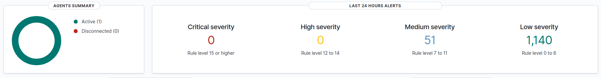
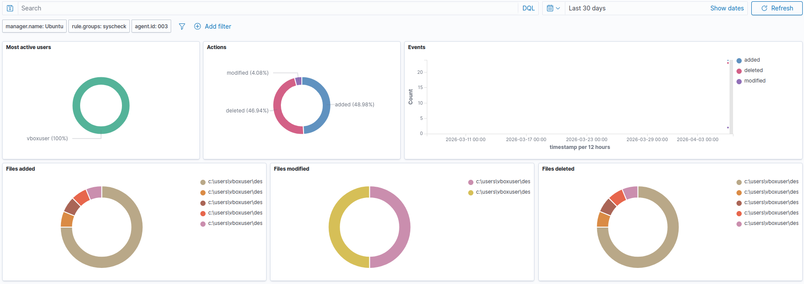
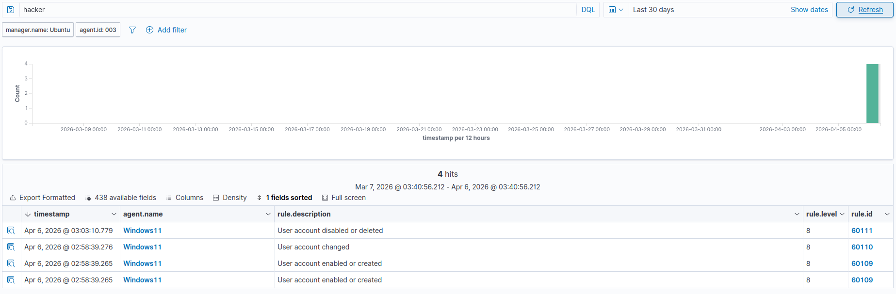

# Wazuh-SIEM-HomeLab

## Overview
Built a fully functional Security Information and Event Management (SIEM) home lab using Wazuh to simulate a real-world SOC analyst environment.

## Architecture
- Wazuh Manager/Server: Ubuntu 24.04 (VirtualBox VM)
- Monitored Endpoint: Windows 11 (VirtualBox VM)
- Network: Host-only network connecting both VMs

## What I Built
- Deployed Wazuh SIEM platform including Wazuh Indexer, Manager, and Dashboard
- Created a Windows 11 agent and connected it to the Wazuh manager
- Configured real-time File Integrity Monitoring (FIM) on the Windows agent
- Simulated attacks and verified detection through the Wazuh dashboard

## Attacks Simulated & Detected
- File creation/modification/deletion - detected via real-time FIM with cryptocraphic hash validation (MD5, SHA1, SHA256)
- Unauthorized user account creation - simulated attacker persistence technique, detected and alerted in Wazuh SIEM dashboard
- Account Deletion - detected remediation of malicious accounts

## Key Skills Demonstrated
- SIEM deployment and configuration
- Security monitoring and alert analysis
- Endpoint agent deployment
- Attack simulation and detection
- VirtualBox network configuration

## Screenshots

### Agent Overview

### File Integrity Monitoring Dashboard

### Threat Hunting - Attack Detection

